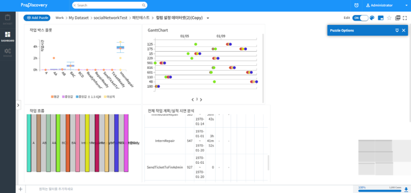
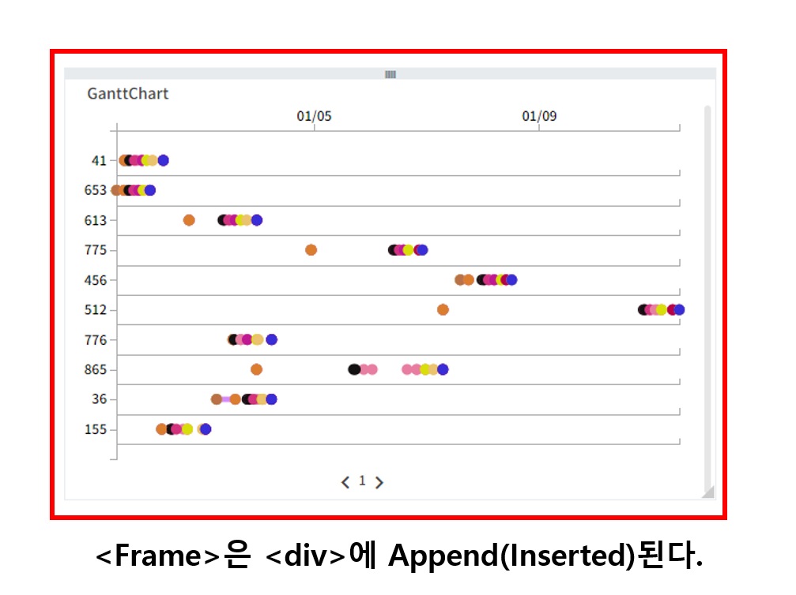
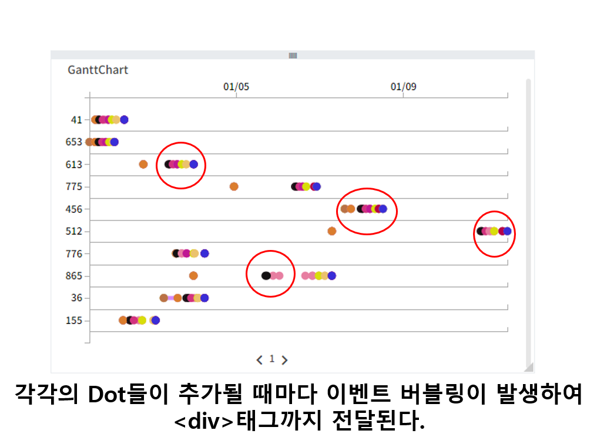
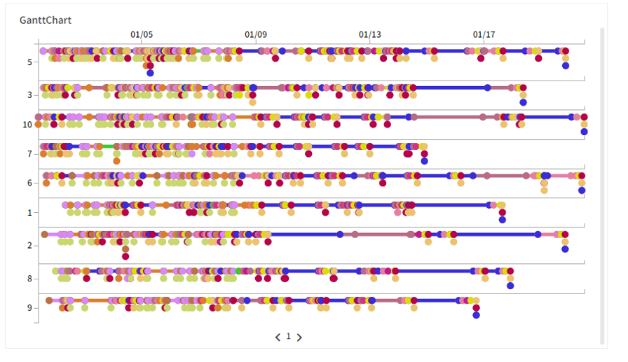
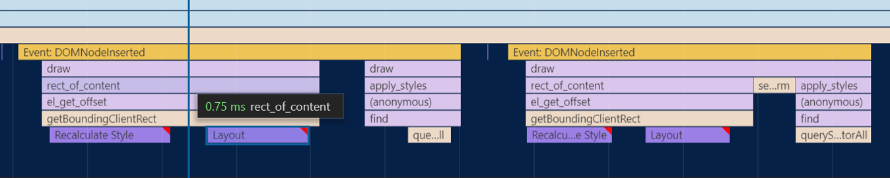
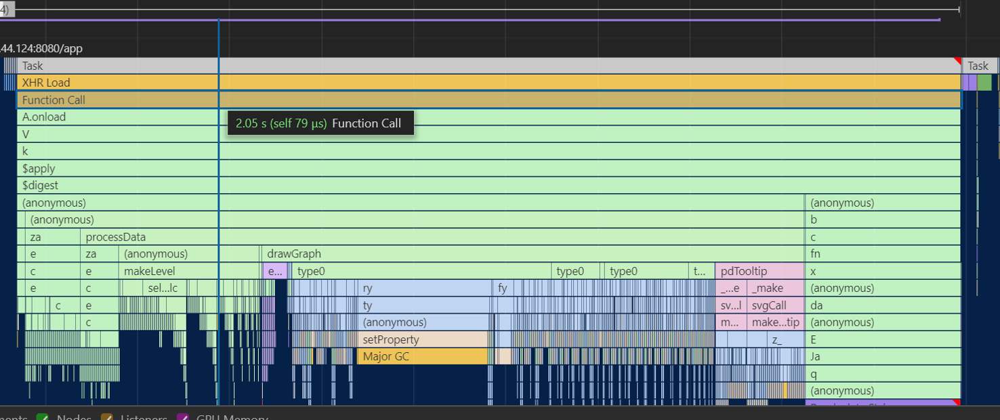

# 이벤트 버블링 관련 치명적 실수

>최악의 실수를 저질러 버렸다. 내가 서드파티 라이브러리를 사용함에 있어 별 의심없이 커스터마이징한 부분이 제품성능의 성능을 최악으로 만드는 주된 원인이 되었다. 정말 부끄러운 실수이다. 그러나 다시는 이런 실수를 반복하지 않겠다는 다짐으로 이 트러블슈팅을 작성한다.

---

현재 재직중인 회사는 데이터 분석툴을 만든다. 작게는 수천건의 데이터에서부터 수십, 수백만건에 해당하는 데이터를 활용해 차트를 만들어 시각화 및 수치화를 해야한다. 그만큼 브라우저에 부담되는 렌더링 작업이 많아지기 마련이다. 다음이 제품의 데이터 분석 대시보드이다.

 
 

 
 

이 대시보드에서는 `퍼즐`이라 칭하는 데이터 분석 차트를 동적으로 추가하고 삭제하는 등의 작업을 수행할 수 있다. 

### 무엇이 문제였는가?

나는 입사 초기에, 위의 이미지 우측 하단에 보이는 미니맵을 구현하는 이슈를 맡아 처리한 적이 있다. 대시보드의 미니맵은 대시보드 전체를 축소화하여 현재 위치를 표시하거나 원하는 위치로 바로 이동할 수 있는 기능이다. 나는 이 기능을 [pagemap.js](https://larsjung.de/pagemap/)라는 서드파티 라이브러리를 활용해 구현하였다.

이 미니맵은 실시간으로 갱신 되어야 하는 조건들이 있다. 예를들어, 브라우저의 크기가 변경될 때, 스크롤링으로 조회중인 View의 위치가 변할 때 등이다. 이 두 경우는 기존 라이브러리에서 다음과 같이 구현되어 있었다. 

    var init = function init() {
        canvas.style.cursor = 'pointer';
        on(canvas, 'mousedown', on_drag_start);
        on(viewport || WIN, 'load resize scroll ', draw);
        //...
    }

그러나 제품의 특성상 미니맵이 갱신되어야 하는 조건들이 추가된다. 바로, 차트가 추가되거나 삭제될때(add, remove), 차트의 크기가 변경될 때(resize) 그리고 차트의 위치가 변경될 때(dragend))이다. 

나는 이를 만족시키기 위해 위의 코드에 다음과 같이 이벤트 리스너를 추가하였다.

    var init = function init() {
        canvas.style.cursor = 'pointer';
        on(canvas, 'mousedown', on_drag_start);
        // Event Listener 추가 -> DOMNodeInserted DOMNodeRemoved transitionend
        on(viewport || WIN, 'load resize scroll DOMNodeInserted DOMNodeRemoved transitionend', draw);
        //...
    }

**즉 `DOMNodeInserted`, `DOMNodeRemoved`, `transitionend`이 세가지 이벤트가 대시보드에서 발생할 때 미니맵이 갱신되도록 라이브러리를 커스터마이징 하였다.**

그러나 이 안일했던 커스터마이징은 어쩌면 나의 개발인생에서 최악의 실수 중 하나가 될지도 모르겠다.

### 왜 문제인가?

저 작업을 진행할 때 까지만 하더라도 나는 자바스크립트 이벤트 전파에 대한 원리를 제대로 이해하고 있지 못했다. 즉, **이벤트의 버블링에 대한 고려없이 해당 코드를 추가한 것이다.**

미니맵을 갱신하기 위한 이벤트는 대시보드상의 특정 `
` 태그에 바인딩되어 있다. 나는 이벤트의 타깃이 되는 해당 `
` 태그에서 `DOMNodeInserted`, `DOMNodeRemoved`, `transitionend` 이벤트는 단순히 차트가 통째로 추가, 삭제, 이동하였을 때에만 발생하리라 생각하였다. 예를들어 다음과 같이 생긴 차트를 대시보드에 추가한다고 가정해보자.

 

 

나는 차트에 해당하는 `<Frame>(가칭)` 태그가 대시보드의 `
` 태그에 추가될 때 발생하는 이벤트 단 한번만이 미니맵을 갱신하는 이벤트로써 인지될 것이라 생각하였다. 그러나 이는 나의 완전히 잘못된 판단이었다.

차트 위에 보이는 작은 Dot 하나하나는 모두 D3.js를 통해 동적으로 추가되는 SVG 태그들이다. 이러한 태그들은 `<Frame>`에 append되면서 역시 `DOMNodeInserted` 이벤트를 발생시킨다. 그러나, 이 이벤트는 버블링되어 `<Frame>`을 지나 `
` 태그까지 전달이 된다. 

 

 

만약 차트위에 표현해야할 요소들이 셀 수 없이 많아진다면 어떻게될까? **차트에 그려지는 요소의 개수만큼 이벤트의 버블링이 발생하고 그때마다 대시보드의 미니맵이 갱신되어 브라우저의 성능이 급격히 감소하게 된다.**

### 어떻게 발견하였는가?

처음 이 이슈를 발견하기 전에는 단순히 위에 소개한 차트의 렌더링 속도를 개선하는 이슈를 맡아서 진행하던 중이었다. 차트에 표시되어야 하는 Dot가 많아질수록 렌더링 속도가 급격히 감소하며, 심한 경우 브라우저가 죽어버리는 경우까지 발생하였다. 아래의 그림이 해당 현상을 발생시킨 차트이다.

 

 

나는 원인이 무엇인지 파악하기 위해 크롬 개발자 도구의 Performance를 통해 차트가 렌더링되는 과정을 Profiling 하여 분석해 보았다. 다음이 그 결과이다.

 

 

잘 보이지 않지만, 차트가 그려지기까지 약 100초 이상의 시간이 소요되었으며, Main 세션을 확인하면 특정 부분에서 Warning Sign이 반복적으로 나타나는 것을 확인할 수 있다. 나는 해당 부분을 확대해 보았다.

 

 
 
그림에서 확인 할 수 있듯이, `DOMNodeInserted`이벤트가 지속적으로 발생하며 미니맵을 반복해서 redraw하고 있었다.

### 어떻게 해결하였는가?

일단, 라이브러리에 추가한 이벤트를 다시 원래의 상태로 되돌려 놓았다. 이후, 제품 프레임워크 자체에서 대시보드 상의 차트에 변화가 생길 경우 특정 함수를 수행시키는 로직을 구현함으로써 해결하였다. 

### 결과는?

제품의 성능은 비교가 안될 정도로 개선되었다. 다음은 미니맵 갱신 방식을 수정한 이후의 profile이다. 

 

 

내가 저지른 실수가 얼마나 치명적인지 단적으로 보여준다. 기존 100초 이상 걸리던 작업이 약 2초대로 50배 이상 성능이 개선되었다. 

 

### 글을 마치며

**부끄러운 나의 실수는 기본에 대해 얼마나 잘 이해하고 있느냐가 중요한지 다시 한번 깨닫게해 주었다.** 지금에 와서야 이벤트 리스너에 등록된 이벤트들이 어떤 흐름을 통해 전파되는지에 대해 흐름을 이전보다는 잘 이해하고 있지만, 저 기능을 구현하는 당시의 나는 그렇지 못하였다. 최근에는 특정 기술을 익힌다기 보다는 자바스크립트의 기초와 동작 원리 등을 학습하는데에 더 집중하고 있는데, 이런 나의 학습 방향에 대해 다시 한번 확신하게 되는 계기가 되었다.

또한 **디버깅의 중요성**을 체감하였다. 이번 이슈는 개발자도구를 활용한 디버깅이 없었다면 아마 평생 찾아내기 어려운 이슈였을 것이다. **특히 크롬 개발자도구의 Performance 기능은 제품의 성능 이슈를 트래킹 할 수 있는 매우 유용한 기능으로써 앞으로 클라이언트 개발을 진행하는 데에 있어서 브라우저의 성능을 측정해 분석하려는 습관을 길러야겠다.** (Performance 기능을 활용하는 방법은 [이곳](../4_Etc/크롬_개발자도구_Performance_활용하기.md)에 따로 정리해 두었다.) 또한 크롬 개발자 도구에는 아직 내가 사용해보지 못한 많은 기능들이 있는데, 차근차근 이러한 기능들을 활용해 보면서 더욱 효율적으로 개발할 수 있는 방법을 연구해 봐야겠다.

좋은 경험이었다. 그리고 조금 오그라드는 말이지만 이번 이슈를 해결하면서 한층 더 성장할 수 있는 계기가 되었기 때문에 마냥 부끄럽다기보단 기쁘다는 말을 마지막으로 이 글을 마친다.