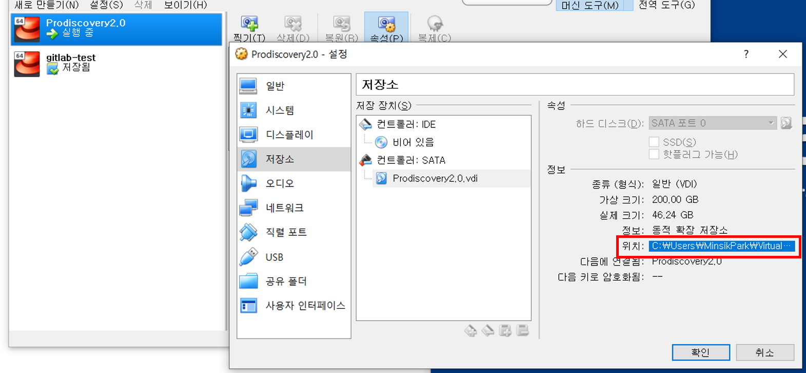
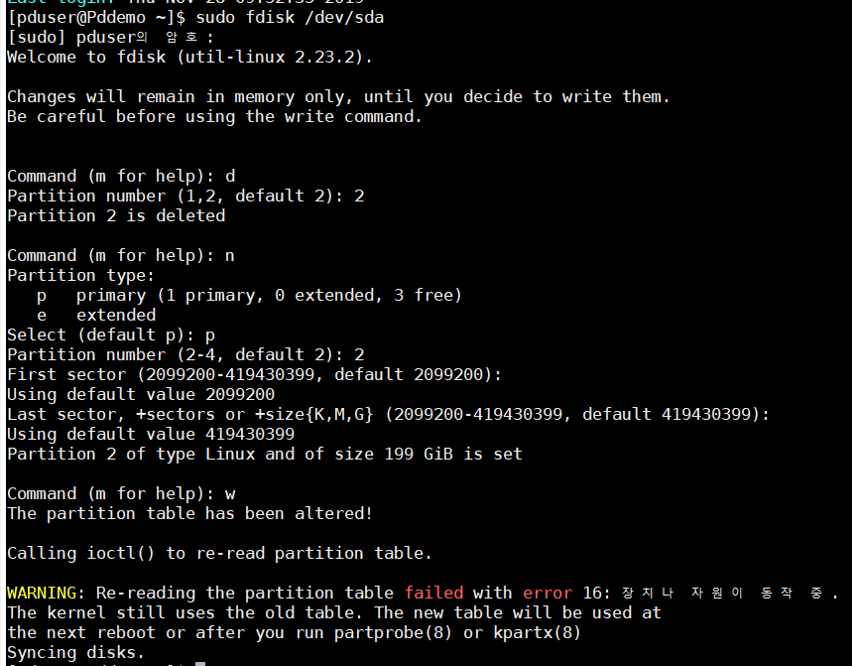

# Oracle VM centOS 저장공간 늘리기

회사에서의 개발환경으로 Oracle VM에서 CentOS를 사용한다. 
데이터를 다루는 제품을 개발하는 만큼 그 데이터를 저장하기 위한 공간이 꽤나 많은 용량이 필요한데 입사 초기 아무것도 몰랐던 나는 최대 저장공간을 40기가로 한정지어 놓았다.

이제 1년이 지난 지금 다양한 테스트 데이터를 업로드하다보니 지속적으로 용량이 부족한 문제가 발생하였고, 그때마다 필요없는 파일들을 지워왔지만 매번 예상치 못한 상황에서의 저장공간 부족은 여러모로 효율성을 매우 단축시켰다. 

따라서 이기회에 VM의 저장공간을 좀 더 늘리는 방법을 찾아 보았다. 

---

### 1. 저장공간을 늘릴 VM의 파일 위치 경로 확인 

타깃VM에서 `우클릭 > 설정 > 저장소`를 통해 vdi의 경로를 확인할 수 있다. 
 
 

 
 

### 2. CMD에서 VirtualBox이 설치된 경로로 이동

일반적으로 

    cd C:\Program Files\Oracle\VirtualBox

에 설치되어 있다.

### 3. 저장공간 늘리기 

    > VboxManage modifyhd [vdi 경로] --resize [저장공간 사이즈 MB]

vdi 경로는 위 1번에서 찾은 경로를 입력해 주면 된다. 만약, 현재 경로와 동일한 위치라면 경로를 제외한 파일명만 입력해주면 된다.

늘리고자 하는 저장공간의 MB단위를 입력한다.
명령어를 입력한 후, 다시 1번 경로로 가서 확인하면 저장공간이 변경된 것을 확인할 수 있다.

### 4. 가상머신 접속

저장공간을 늘린 후 가상머신에 접속한다.

가상머신의 저장공간은 늘어났지만 사용가능한 파티션은 여전히 그 전과 동일하기 때문에 파티션을 똑같이 늘려주어야 한다. 

VM의 터미널에서 다음과 같은 명령어를 입력한다.

    sudo fdisk /dev/sda

이후 순서대로 다음과 같이 입력한다.

    > d (파티션 delete)
    > 2 (기존 파티션 중 두번째 파티션 dev/sda2 삭제)
    > n (새 파티션 생성)
    > p (Primary 파티션 선택)
    > 2 (2번으로 지정)
    > [enter 입력]
    > [enter 입력]
    > w (변경사항 기록)
 
 

 
 

### 5. 재부팅

    $ reboot

### 6. 물리 볼륨 조절

    sudo pvresize /dev/sda2
    sudo pvscan 

### 7. 논리 볼륨 공간 추가

    sudo lvextend -l +100%FREE /dev/mapper/centos-root

### 8. 논리 볼륨 조절 

    sudo lvresize -r -l +100%FREE /dev/mapper/centos-root

### 9. 정상적으로 변경되었는지 확인

    df -h