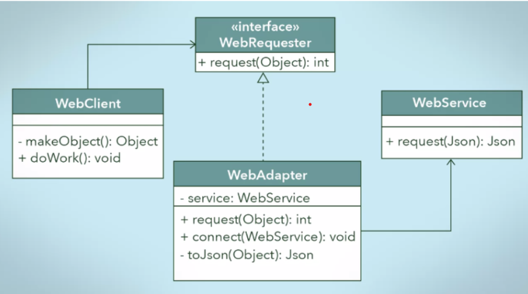

# Adapter Pattern

[https://yaboong.github.io/design-pattern/2018/10/15/adapter-pattern/](https://yaboong.github.io/design-pattern/2018/10/15/adapter-pattern/)

위 링크를 참고하였다.

--- 
어댑터 패턴은 우리가 흔히 말하는 어댑터, 즉 규격이 다른 플러그인이라던가, 도구간의 상호 연결을 도와주는 매개의 역할과 동일하다. 

즉, 객체지향 프로그램에서 특정 규격(인터페이스)를 만족하지 않는 클래스를 마치 같은 인터페이스를 구현한 클래스인 것 처럼 사용할 수 있도록 설계하는 디자인 패턴이다. 이를 간단한 다이어그램으로 표현하면 다음과 같다.

  

 
 

만약 Web Client에서 특정 요청을 보내야 한다고 가정해 보자. doWork라는 메서드를 통해  WebRequester라는 인터페이스를 구현한 클래스를 통해 여러 요청을 보내야 하는데, 이때 어떤 이유로 인해 WebRequester를 구현하지 않는 새로운 클래스 WebService를 사용해야 하는 경우라면 어떻게 해야할까?

먼저, 어댑터 패턴을 고려하지 않고 단순히 생각해 보자. 일반적으로 이런 경우라면 특정 조건에 따라 WebRequester를 사용하는 경우와 Web Service를 사용하는 경우로 분기해 처리할 수도 있을 것이다. 

    if(someCondition){
    	Josn josn = makeJson();
    	webService.request(json);
    } else {
    	Object obj = makeObject();
    	webRequester.request(obj);
    }

또한, 만약 앞으로 WebRequester를 사용할 일이 다신 없을 것이며 모든 웹 요청이 WebService를 통해 이루어진다는 것이 확실할 경우라면 기존 레거시 코드를 걷어내고 모두 WebService를 기준으로 리팩토링 하는 경우도 고려해 볼 수 있다.

그러나 만약 WebRequester를 앞으로도 쭉 사용해야 한다면? 그리고 WebService와 같이 새로운 클래스가 사용될 여지가 있다면? 그리고 현재 프로젝트의 규모가 너무 커서 리팩토링 하기에 여유가 없다면? 과연 이런 경우에는 어떻게 처리할 수 있을까?

이럴때 바로 어댑터 패턴이 빛을 보게 된다. 다시 위의 그림을 보자. 위의 그림에서는 WebRequester를 구현한 새로운 클래스 WebAdapter를 새로 생성한 후, 새롭게 적용할 WebService를 감싸는데 활용한다. 즉, 겉으로 보이는 껍데기는 WebRequester를 구현함으로써 기존 구조에 호환되도록 하였지만, **실제 내부에서는 WebService 객체를 받아 WebRequester를 통해 오버라이드 된 메서드 내부에서 활용하는 방식으로 구현되어 있다**.  이를 간단히 코드로 표현하면 다음과 같다. 

    class WebAdapter implements WebRequester {
    
    	private WebService webService;
    
    	public void connect(WebService webService){
    		this.webService = webService;
    	}
    
    	private Json toJson(Object obj){
    	 // convert to Json;
    		return Json;
    	}
    
    	@override
    	public int request(Object obj){
    		Json json = toJson(obj);
    		return webSerice.request(json);
    	}
    }

이런식으로 활용하게 될 경우 앞으로 또 다시 새로운 클래스를 활용해야 하는 경우에 새로운 어댑터 클래스만 생성해 활용하면 되므로 기존의 코드에 큰 변화 없이 작업을 할 수 있다.