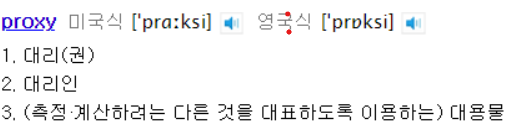
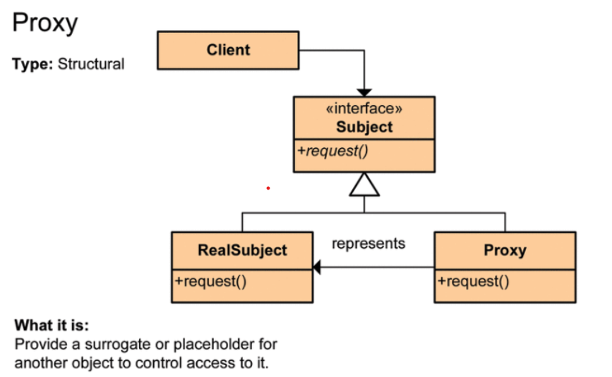
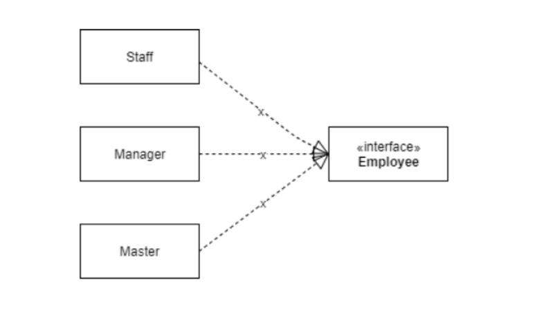

# [Design Pattern] Proxy Pattern

프록시, 프록시, 프록시!!! 프록시란 대체 무엇인가? 참 여기저기서 프록시라는 말들이 많이 나온다. 먼저 proxy의 의미가 무엇인지 알아보자.

먼저 일반적으로 사용되는 proxy의 뜻은 다음과 같다.

 
 

 
 

대리라...대리로 수행해준다는 의미의 프록시, 그렇다면 프록시 패턴은 무엇일까?

---

영어사전의 의미 그대로 프록시패턴은 어떤 클래스가 수행해야 하는 일을 다른 클래스가 위임받아 한다는 것을 의미한다. 프록시 패턴을 설명할 때 가장 일반적으로 소개되는 클래스 다이어그램의 구조는 다음과 같다.

 
 

 
 

`Subject`라는 인터페이스가 있고 이를 구현한 `RealSubject`라는 클래스가 있을 때, 실제 호출되는 클래스는 `Proxy` 클래스로써 해당 클래스 내부에서 **특정 조건을 만족하거나 수행되어야하는 작업을 전후**로 하여 실제 작업이 수행되도록 `RealSubject` 로 작업을 위임하는 형태의 패턴이다.

만약 스태프, 매니저, 점장으로 구성되어 있는 매장이 있다고 가정해보자. 기존에는 직급에 상관없이 다른 직원의 정보를 조회할 수 있는 시스템이 갖추어져 있었지만, 어떤 일을 계기로 자신보다 높은 계급의 직급의 직원의 조회는 조회할 수 없도록 체계가 바뀌었다고 한다면 어떻게 할까?

기존 각 직원들의 정보는 다음과 같이 관리되었다고 가정해보자.

### Person 인터페이스

    Enum GRADE {
    	Staff, Manager, Master
    }
    
    class interface Person{
    
    	public String getName();
    	public String getAddress();
    	public String getInformation( Person viewer);
    }

### Person 구현체 Employee

    class Employee implements Person{
    
    	String name;
    	String address;
    	GRADE grade;
    
    	public Employee(String name, String address, GRADE grade){
    		this.name = name;
    		this.address = address;
    		this.grade = grade;
    	}
    
    	@override
    	public String getName(){
    		return name;
    	}
    
    	@override
    	public String getAddress(){
    		return address;
    	}
    
    	public GRADE getGrade(){
    		return grade;
    	}
    	
    	@override
    	public String getinfomation(Person viewer){
    		return getName() + "/" + getAddress() + "/" + getGrade();
    	}
    }

위와같은 변화에 대응하기 위해서는 어떻게 해야할까?

간단히 다음과 같이 클래스를 재 설계 할 수 있을 것 같다.

 
 

 
 

이후 각각의 구현체 내부에서 View의 권한을 체크해 처리하는 로직을 추가할 수 있다.

그러나 이 경우 기존의 시스템 구조를 바꾸어야 하거나, 앞으로 Grade의 종류가 많아질 때마다 구현체를 새롭게 생성해 주어야 한다는 문제가 발생한다. 또한, 앞으로 정보조회 관련하여 정책이 바뀔 경우 모든 클래스를 다시 수정해 주어야 한다.

그렇다면 프록시 패턴은 이런 문제를 어떻게 해결할 수 있을까?

### ProxyEmploee

    class ProxyEmploee implements Person{
    	Employee emploee;
    
    	public ProxyEmploee(Emploee emploee){
    		this.emploee = emploee
    	}
    	
    	@override 
    	public String getName(){
    		return emploee.getName();
    	}
    
    	@override 
    	public String getAddress(){
    		return emploee.getAddress();
    	}	
    	
    	public GRADE getGrade(){
    		return emploee.getGrade();
    	}
    
    	@override 
    	public String getInformation( Emploee viewer){
    		switch(viewer.getGrade()){
    			case Staff :
    				if( emploee.getGrade() == GRADE.Staff) 
    				return emploee.getInformation( viewer);
    			case Manager :
    				if( emploee.getGrade() == GRADE.Staff || emploee.getGrade() == GRADE.Manager) 
    				return emploee.getInformation( viewer);
    			case Master : 
    				return emploee.getInformation( viewer);
    			default : throw new NotAuthorizedException();
    		}
    	} 
    }

위와같이 프록시 패턴을 적용한 프록시 클래스를 생성한 후 활용하게 될 경우 Viewer의 Grade에 따라 정보조회 할 수 있는 경우의 수를 분기처리할 수 있다. 

앞으로 이런 패턴을 어떻게 활용할 수 있을지 고민해 봐야겠다. 일단 이런 패턴을 사용하는 가장 대표적이 예시가 스프링의 AOP라고 하니 대충 어떤 방식으로 사용이 되었을지 감은 오는 것 같다. 