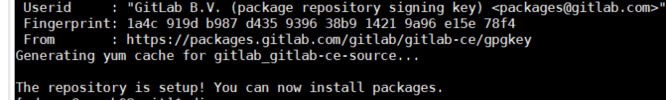
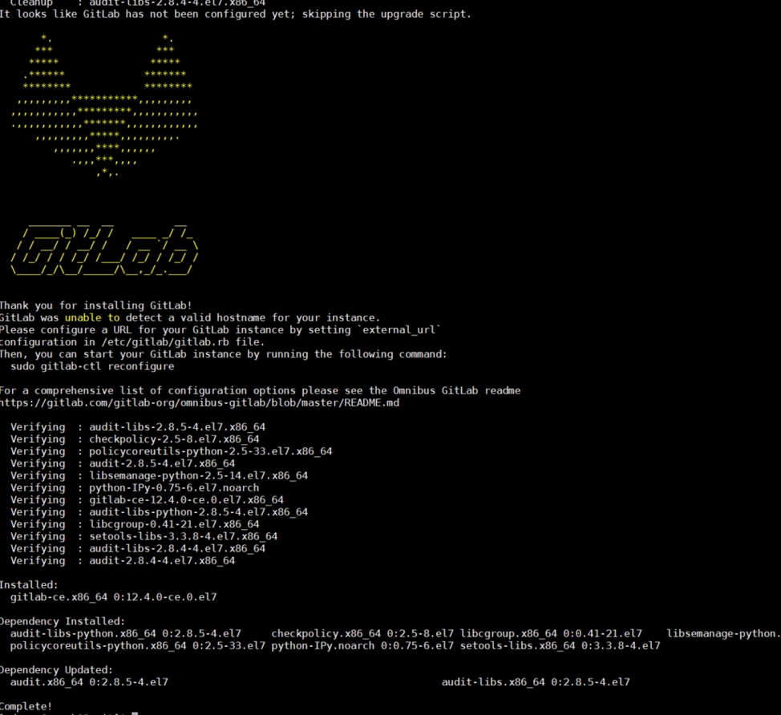
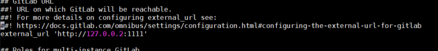

# gitlab 설치하기 (CentOS7)

지난번에 작성한 git과 svn의 간단한 비교에 이어 gitlab을 설치하는 방법에 대해 정리한다. 
설치 환경은 CentOS7 기반의 가상머신으로 현재 테스트 단계에서 임시로 활용할 목적으로 설치한 것이다. 추후 클라우드 서버에 설치하게 되면 해당 내용은 별도로 정리할 예정이다. 

### **1) git 설치**

       $ sudo yum install git

### **2) 깃랩 다운로드에 필요한 패키지 설치**

       $ yum -y install curl policycoreutils openssh-server openssh-clients 

### **3) ssh 서비스 시작**

      $ systemctl start sshd

### 4) **ssh 자동시작 설정**

       $ systemctl enable sshds

### **5) 깃랩 설치**

       $ curl -sS https://packages.gitlab.com/install/repositories/gitlab/gitlab-ce/script.rpm.sh | sudo bash

 

 
    위와같은 메시지가 생성되면 패키지를 정상적으로 설치가능함.
 
 

        $ sudo yum -y install gitlab-ce

 

설치 완료!

**6) gitlab url 설정하기**

설치된 gitlab관련 파일은 `etc/gitlab`에 저장된다. 해당 디렉토리로 이동하여 깃랩에 접속하기 위해 사용할 url을 지정해 줄 수 있다. 

    $ cd /etc/gutlab/
    $ sudo vim gitlab.rb

 

    

 

external_url의 ip와 port를 설정해 준다.
	
이후 방화벽 설정을 통해 url에 기입한 port를 오픈해주어야 한다.
	
	$ sudo firewall-cmd --permanent --add-port=설정한포트번호/tcp
	$ sudo firewall-cmd --reload
	
이후 설정한 gitlab config파일을 반영해야 한다.
	
	$sudo gitlab-ctl reconfigure
	
위 작업까지 끝나고 나면 재설정하는 작업이 시작되고 다음과 같은 메시지가 생성되면 gitlab 설치 작업은 마무리 된다.

 

    

 

---

여기까지 가장 기본적인 설정으로 gitlab을 설치하는 과정을 정리해 보았다. 실제로는 메일관련 설정과 보안관련 설정 등 다양한 설정들을 추가할 수 있는데, 이는 추후 관련된 작업을 수행하게 될 때 하나하나 별도로 정리해야겠다.