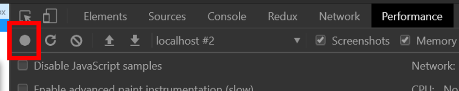
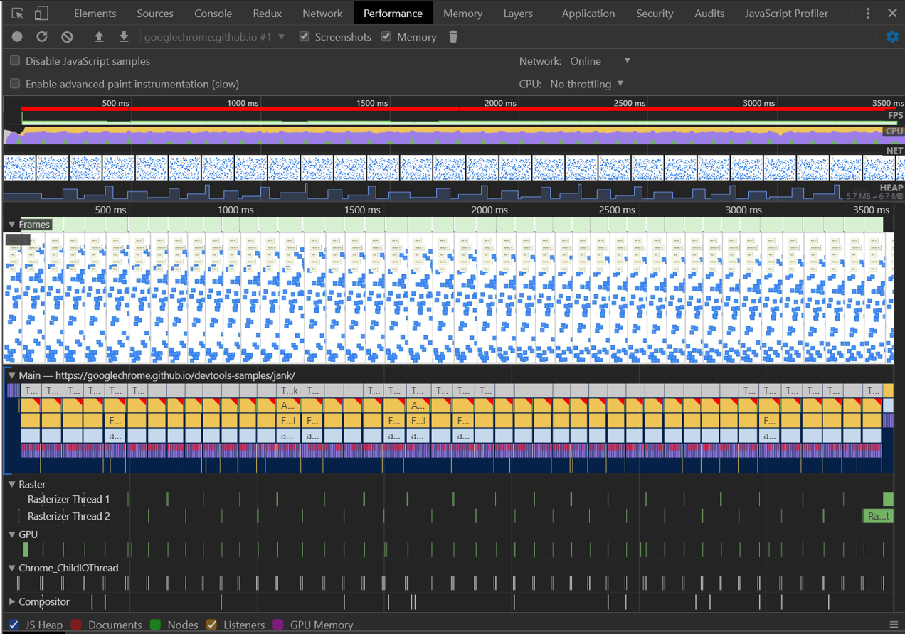
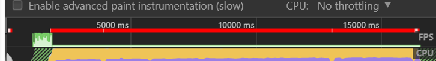
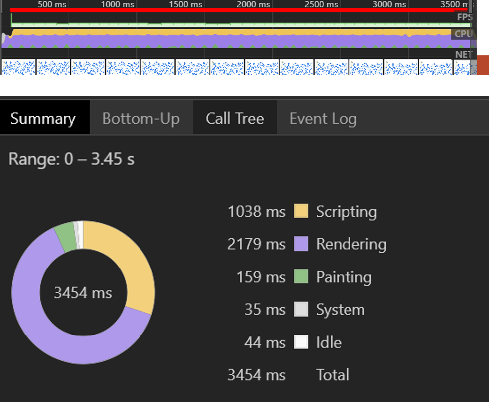
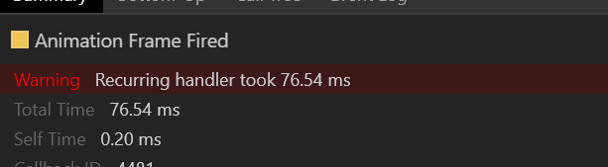
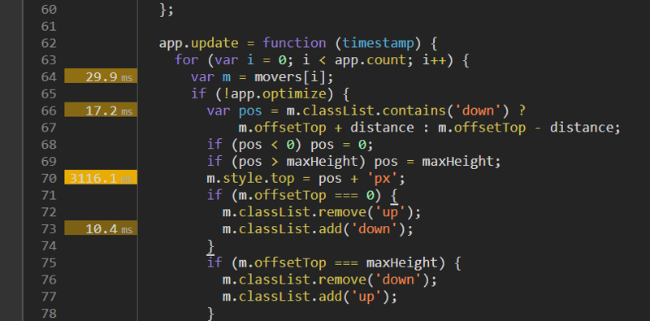

# 크롬 개발자도구 Performance 활용하기

크롬 개발자도구. 알면 알수록 유용한 기능들이 많은 것 같다. 오늘은 Performance라는 기능에 대해 간략히 정리해보려 한다.

> 실제 최근 회사에서 이 기능을 활용해 브라우저의 성능을 크게 저해하는 요소를 발견해 수정하였다. 

---

먼저 Performance 기능을 사용하기 위해서 크롬 브라우저를 Incognito Mode로 실행한다. 이는 여러 확장프로그램이 정확한 퍼포먼스 측정을 방해할 수도 있기 때문에 이를 방지하기 위한 것이며, 번거롭다면 굳이 이를 따를 필요는 없다.
 
 
 

 
 

### 성능 기록하기

Performance를 사용하는 방법은 간단하다. 개발자도구에 들어가 Performance탭을 클릭하고 Record 버튼을 클릭하면 된다. Record 버튼을 클릭하고 웹페이지 내에서 성능을 측정하고자 하는 기능을 실행한다. 이후, Stop버튼을 클릭하면 성능측정이 완료된다. 아래의 그림은 성능 측정이 끝난 이후에 확인하게 될 결과이다. 
 
 
 

 
 
 
무엇인가 많이 복잡하고 신기하다. 그러나 이곳에서 얻게될 다양한 정보는 현재 개발중인 웹페이지의 사용자 경험을 크게 개선하기 위해 유용하게 활용될 것이다. 

### 분석하기

#### FPS : Frame Per Second

 
 

먼저 가장 첫번째 나오는 라인은 FPS를 의미한다. 현재 이미지에서는 이 색이 빨갛게 표시되고 있는데, 이는 현재 프레임이 구성되는 시간이 매우 느리다는 것을 의미하며, 이는 곧 사용자 경험이 매우 좋지 못하다는 것을 뜻한다. 

 

#### CPU

두번째 라인은 CPU의 사용량이다. CPU 차트가 색으로 가득차 있다는 것은 레코드를 기록하는 동안 사용 가능한 모든 CPU자원을 사용했다는 것을 의미한다.

CPU를 사용하는 이벤트는 다양하다. CPU 라인에 표시된 각각의 색상은 서로 다른 이벤트를 의미하는데, 이는 하단 Summary탭에 나와있는 레전드로 각각 어떤 값을 의미하는지 확인할 수 있다.

 

#### Main

 

Main 세션에서는 메인스레드에서 수행된 작업의 프레임차트를 보여준다. 각각의 Bar는 CPU에서 확인했던 것과 같이 다른 타입의 이벤트를 의미하며 이 역시 Summary 탭에서 그 의미를 확인할 수 있다. 

 

>  만약 이 Bar 우측 상단에 빨간 삼각형이 있다면 이는 Warning의 의미로 해당 이벤트와 관련된 이슈가 존재함을 의미한다.

차트의 X 축은 시간을 의미한다. Bar의 길이가 길수록 오래걸린 이벤트이다.

차트의 Y축은 Call Stack을 의미한다. 위쪽부터 콜스택에 들어간 순서이다. 

Main에서 각 Bar를 클릭한 후 Summary를 조회하면 해당 이벤트가 수행된 시간, 관련 소스의 위치 등의 상세 정보를 확인할 수 있다. 

Summary에서 해당 이벤트와 관련된 소스를 따라가보자.

해당 이벤트를 수행한 함수 내부에서 각각 라인이 얼만큼의 시간을 소요했는지 확인할 수 있다.