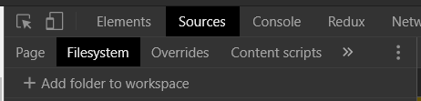
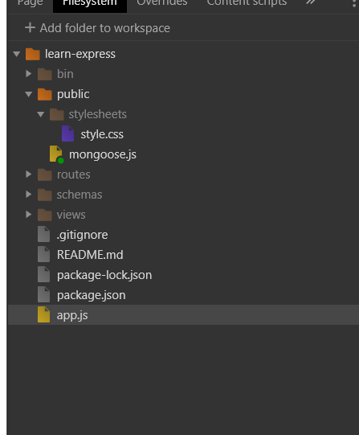

# 크롬 개발자도구에서 JS원본소스 수정하기

 자바스크립트로 프론트엔드 작업을 하다보면 DevTools를 통해 소스를 수정하는 일이 빈번히 발생한다. 물론 이렇게 작성한 코드는 페이지를 리로드 하게될 경우 초기화되는 임시코드이다. 즉, DevTools를 통해 작성한 코드는 다시 IDE에 복사붙여넣기 하거나 다시 코드를 입력해야 하는 번거로음(?)이 존재한다.

 만약 DevTools에 작성한 코드를 실제 프로젝트 소스코드에 반영한다면 어떨까?

 (다른 브라우저는 어떤지 모르겠지만) 크롬의 DevTools에서는 이러한 기능을 제공한다. 즉, DevTools에서 수정한 코드가 휘발성이 아닌, 실제 컴퓨터 파일시스템에 저장된 소스코드에 반영되는 기능이다. 이번 포스트는 해당 기능을 설정방법에 대해 간단히 정리한다.

---

해당 설정은 크롬 DevTools의 Sources탭의 FileSystem에서 설정이 가능하다. 

해당 탭에서 Add filter to workspace를 클릭하면 로컬컴퓨터에 저장되어 있는 프로젝트의 경로를 지정해 DevTools를 통해 수정하고자 디렉토리를 설정할 수 있다.

디렉토리를 설정하고 나면 다음과 같이 해당 디렉토리에 접근여부를 묻는 메시지가 생성된다. 아무래도 보안관련해서 문제가 발생할 수 있기 때문인듯 하다. (자세한 내용은 더 알아봐야 한다.)

`allow`를 클릭하고나면 workspace에 다음과 같이 디렉토리가 추가된 것을 확인할 수 있다.

이제 수정하고자 하는 파일을 클릭하면 기존 source탭에서 임시로 소스를 작성하고, break-point를 설정하는 등 디버깅의 기능을 그대로 활용함과 더불어 수정된 소스를 즉각 로컬 파일에 적용할 수 있다. 

해당 기능은 JS 파일뿐만 아니라, HTML, CSS 등 네트워크를 통해 브라우저로 전송되는 모든 static파일에 적용이 가능하다. 

### 한계

그러나 현재 Chrome의 사용명세(?)에서 말하길 해당 기능에는 다소 한계가 존재한다. 크게 두가지 이슈가 있는데 하나는 소스맵과 관련된 이슈이고, 또 다른 하나는 특정 프레임워크에 적용시 일부 문제가 발생한다고 한다.

후자의 경우 Create-react-app을 통해 생성된 React프로젝트를 말하는 것 같은데, 해당 npm 패키지를 통해 생성한 React앱만 그런 것인지, 혹은 React 라이브러리로 작성된 모든 프론트엔드 코드가 그런 것인지는 확실하지 않다. 이 부분은 다음에 시간나면 테스트를 한번 해보아야 할 것 같다. 

일단 오늘의 정리는 여기까지. 나도 이번에 처음 사용하게 된 기능인 만큼 아주 기초적인 내용만을 가지고 글을 정리한 것이므로, 추후 해당 기능을 더 사용해보면서 내용을 추가해야 할 것 같다. 

[Chrome DevTools Workspace 공식 문서](https://developers.google.com/web/tools/chrome-devtools/workspaces)